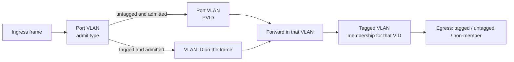

# VLAN

Firmware 2.0.0.1 splits 802.1Q across two pages and has **no** Access / Trunk mode button.
Older “port VLAN / Bridge ID” tutorials belong to another firmware family. See [firmware families](../reference/firmware-families.md).

This page is configuration theory. The tables were not applied on the device, and forwarding was not captured.

## What each page does

| Problem | Page | Field |
|---|---|---|
| Which VLAN an untagged frame belongs to | Advanced → Port VLAN | PVID |
| Whether this port accepts tagged / untagged frames | Port VLAN | Admit frame type |
| Which ports are in a VLAN | Advanced → Tagged VLAN | Membership |
| Whether that VLAN leaves a port tagged | Tagged VLAN | Tagged / untagged ports |

Untagged is **egress** tag handling. PVID is **ingress** classification for untagged frames. They are not substitutes.

Vendor manual V2.0: a VLAN name is an administrative label only; tagged ports keep the tag (similar to an 802.1Q trunk); untagged ports strip it (similar to an access port); ports assigned a PVID on the Port VLAN page **normally appear as untagged members** of that VLAN.

This walkthrough did not submit either direction of that auto-link (PVID → untagged member, or untagged member → PVID). After you configure, re-read both pages.

## Mapping to Access / Trunk

Those words are not on the UI. The table approximates common intent; V2.0 uses the same trunk/access analogy. Isolation still depends on membership in other VLANs. There is no separate ingress-filtering switch, so “untagged only” or a PVID change alone is not a claim of strict isolation. There is also no inter-VLAN routing.

| Port role | Tagged VLAN | PVID | Admit type |
|---|---|---|---|
| Endpoint in VLAN 10 | VLAN 10: untagged member; check it is not still in VLAN 1 | 10 | Untagged only |
| Tagged uplink for VLAN 10/20 | VLAN 10 and 20: tagged members | Not used for normal untagged traffic | Tagged only |
| Mixed uplink: VLAN 1 untagged, 10/20 tagged | VLAN 1 untagged; 10 and 20 tagged | 1 | All |

## Suggested order

Use a window where a brief outage is acceptable. Do not leave the management PC depending only on an untagged VLAN you are about to remove, unless you have confirmed the management plane ignores VLAN (vendor SKS32 text says that; this firmware was not tested).

1. **Tools → Configuration** — download a backup.
2. **Tagged VLAN → Add** — create the data VLAN (form labels IDs 2–4094).
3. Make the uplink a **tagged** member and the access port an **untagged** member. New forms start as non-member.
4. On **Port VLAN**, set the access port PVID and pick admit type from the table above.
5. Return to the tagged VLAN list and check members / tagged / untagged against intent.
6. Click Apply on the port VLAN page and OK in the tagged VLAN dialog, then Save. Button persistence is still [common buttons](../webui/index.md#common-buttons).
7. Verify with a peer switch or a NIC VLAN subinterface. This repo has no verified capture yet.

## VLAN 1

At inspection only VLAN 1 existed:

- Empty name
- Ports 1–10 all untagged members
- While editing VLAN 1, non-member was disabled on every port
- The add form still says VLAN ID 2–4094, but editing VLAN 1 shows 1 in the box

So:

- Do not assume VLAN 1 can be deleted
- Do not assume moving PVID away lets you drop VLAN 1 members
- After you put an access port in VLAN 10, check whether it is **still** an untagged member of VLAN 1. If it is, the broadcast domain may not have split the way you wanted

## Not available in this Web UI

- Pick a management VLAN
- VLAN interface IPs / L3 gateways
- One-click Access / Trunk / Hybrid
- A visible ingress-filtering switch
- Confirmed handling of VID 0, 4095, or reserved IDs

These sit in [unverified items](../reference/known-unknowns.md).
