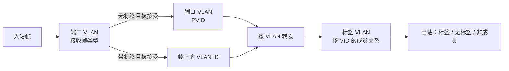

# VLAN

2.0.0.1 把 802.1Q 拆成两页，而且**没有** Access / Trunk 模式按钮。
网上按「端口 VLAN / 桥接 ID」写的旧教程属于另一套固件，见 [固件分代](../reference/firmware-families.md)。

本页是配置原理。表格没有在设备上应用，也未抓包验证转发。

## 两页分别管什么

| 要解决的问题 | 去哪一页 | 字段 |
|---|---|---|
| 无标签报文进来算哪个 VLAN | 高级设置 → 端口VLAN | PVID |
| 这个口收不收带标签 / 无标签帧 | 端口VLAN | 接受的帧类型 |
| 哪些口属于某个 VLAN | 高级设置 → 标签VLAN | 端口成员 |
| 这个 VLAN 从某口出去带不带标签 | 标签VLAN | 标签端口 / 无标签端口 |

Untagged 是**出口**标签处理，PVID 是**入口**无标签分类，二者不能互相替代。

厂商手册 V2.0：VLAN 名称只是管理标签；标签端口保留标签（近似 802.1Q trunk）；无标签端口去掉标签（近似 access）；Port VLAN 页上设了 PVID 的口，**通常会显示为该 VLAN 的无标签成员**。

本次没有提交去验证这个自动联动的任一方向（PVID → 无标签成员，或无标签成员 → PVID）。实际配置时两页都要再看一遍。

## 和常见 Access / Trunk 的对照

界面没有这些词。下面用两页字段去**近似**常见意图；V2.0 也用 trunk/access 来类比。完整隔离还取决于其它 VLAN 的成员关系。当前 UI 未展示独立的入口成员过滤开关，因此不能只改「仅无标签」或只改 PVID 就宣称严格隔离。此处也未见 VLAN 间路由。

| 端口用途 | 标签VLAN | PVID | 接受的帧类型 |
|---|---|---|---|
| 普通终端接入 VLAN 10 | VLAN 10：无标签成员；检查它是否仍留在 VLAN 1 | 10 | 仅无标签 |
| 纯标签上联，承载 VLAN 10/20 | VLAN 10、20：标签成员 | 不用于接收正常无标签流量 | 仅标签 |
| 混合上联：VLAN 1 无标签，10/20 带标签 | VLAN 1：无标签；10、20：标签 | 1 | 所有 |

## 建议顺序

在能接受短暂失联的维护窗口里做。管理口所在电脑不要只靠即将改掉的 Untagged VLAN 连通，除非你确认管理面不受 VLAN 影响（厂商对 SKS32 有此说法，本固件未验证）。

1. **系统工具 → 配置** 下载一份备份。
2. **标签VLAN → 添加**，创建业务 VLAN（表单标注 VLAN ID 2–4094）。
3. 把上联口设为该 VLAN 的**标签**成员，接入口设为**无标签**成员。新建表单里端口初始都是「非成员」。
4. 到 **端口VLAN**，给接入口改 PVID，并按上表选择接收帧类型。
5. 回到标签 VLAN 列表，确认成员、标签端口、无标签端口三列和预期一致。
6. 点「应用」（端口 VLAN 页）和对话框里的「确认」（标签 VLAN），再点「保存」。这些按钮的持久化语义仍见 [公共按钮](../webui/index.md#公共按钮)。
7. 用对端交换机或电脑网卡的 VLAN 子接口验证。本仓库还没有一份已验证的抓包记录。

## VLAN 1 的特殊情况

当时只有 VLAN 1：

- 名称为空
- 端口 1–10 全部是无标签成员
- 编辑 VLAN 1 时，所有端口的「非成员」都被禁用
- 添加表单仍提示 VLAN ID 2–4094，但编辑 VLAN 1 时框内是 1

因此：

- 不要假设 VLAN 1 能被删除
- 不要假设把 PVID 改走之后，VLAN 1 就允许移除成员
- 把接入口划进 VLAN 10 之后，检查它是否**仍然**留在 VLAN 1 的无标签成员里。若仍在，广播域可能没有按你想的切开

## 做不到的事（在这份 WEBUI 里）

- 选管理 VLAN
- 配 VLAN 接口 IP / 三层网关
- 按 Access / Trunk / Hybrid 一键切换
- 看到独立的 Ingress Filtering 开关
- 确认 VID 0、4095 或保留 VLAN 的处理

这些都列在 [尚未确认](../reference/known-unknowns.md)。
